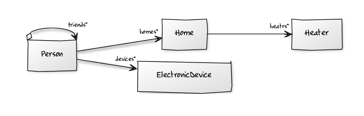

<h2>Design</h2>
Ce document décrit les element clés de conception durant le TP Backend Java (TP2 et TP4)
Nous avons utilisé quelques technologies comme
- JPA
- La gestion de dependance avec Maeven
- Manipulation d'un serveur de données HSQLDB

<h2>Objectif</h2>
<ul>
  <li> Pouvoir manipuler differents objets en utilisant JPA</li>
  <li> Gestion de la connexion à la base de données et manipulation des données avec JPA</li>
  

Le diagramme UML utilisé est le suivant

